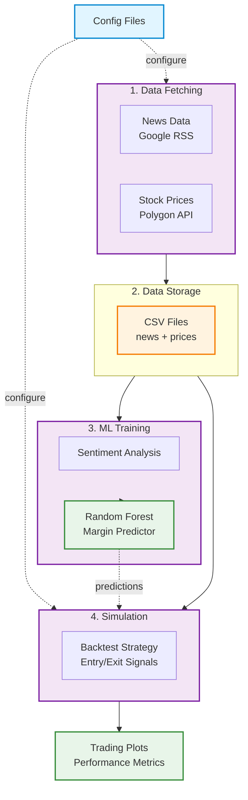
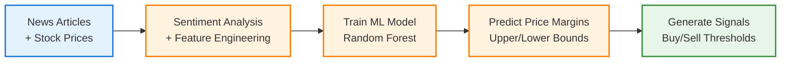

# NVDA Event-Driven Pipeline Architecture

High-level visual overview of the project architecture and data flow.

---

## System Architecture

---

## Data Flow

---

## Pipeline Stages

1. **Data Fetching**: Collect news articles and stock prices
2. **Data Storage**: Save raw data as CSV files with timezone normalization
3. **ML Training**: Train Random Forest model to predict price margins from sentiment
4. **Simulation**: Backtest trading strategy with predicted buy/sell signals
